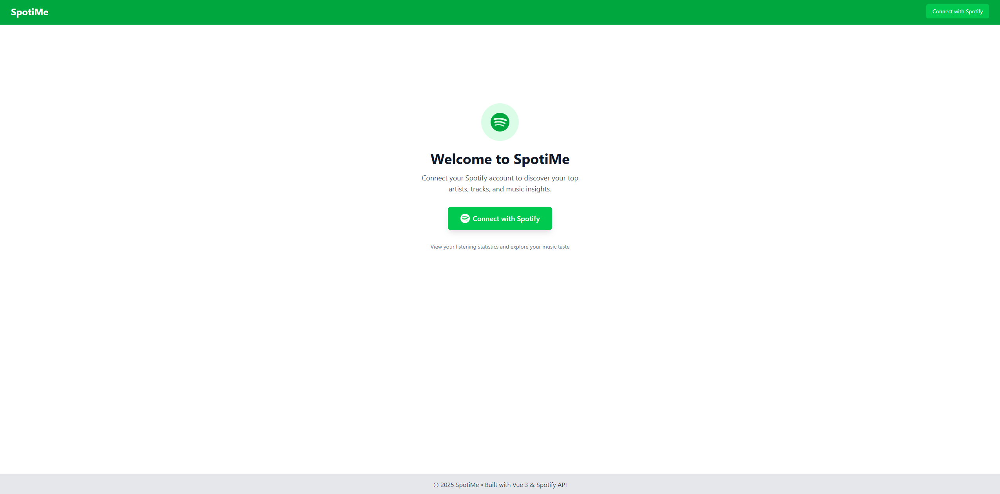
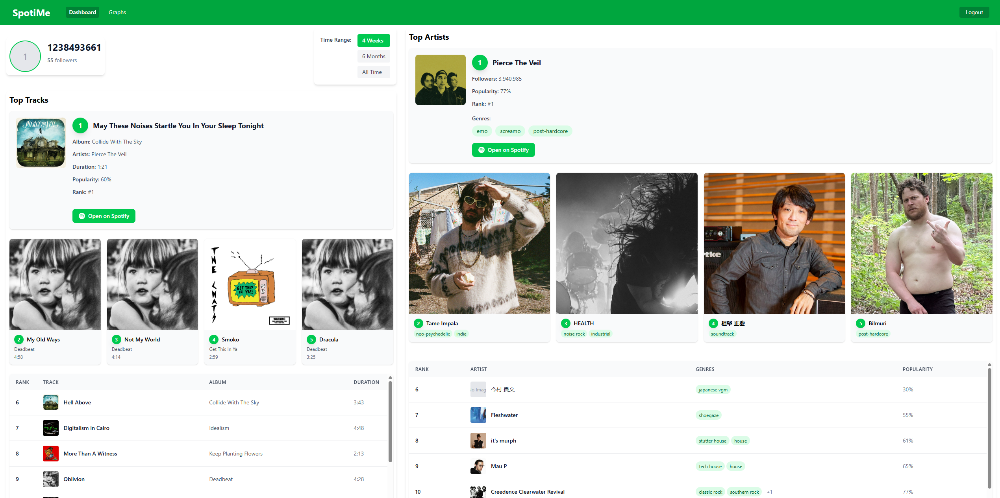
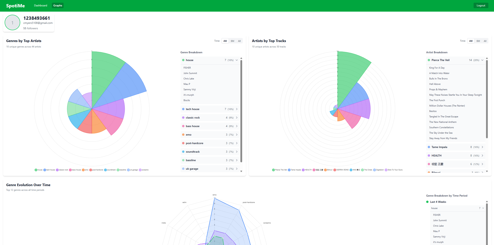
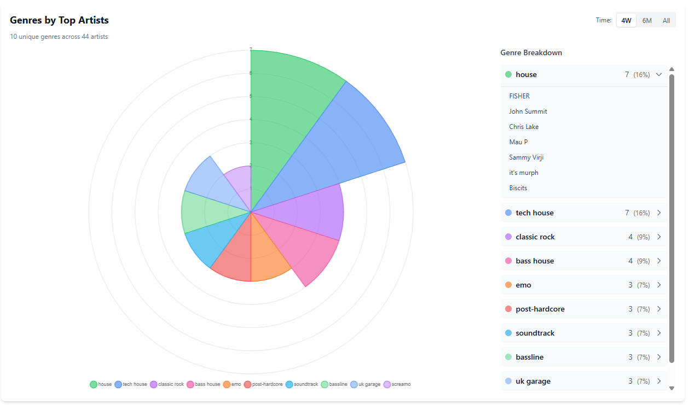
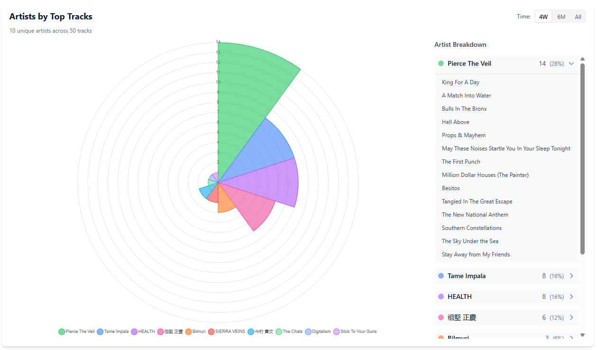
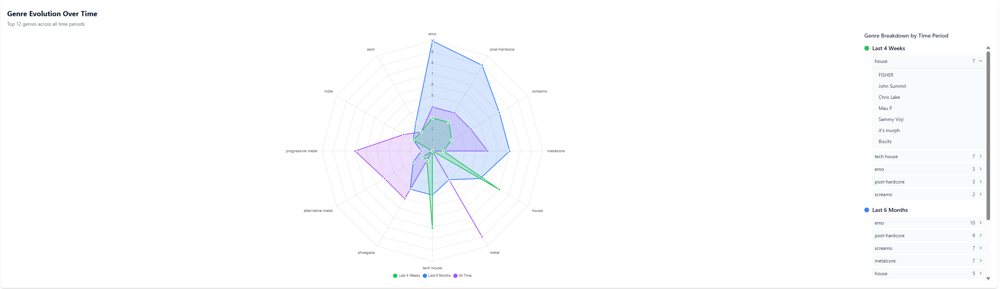
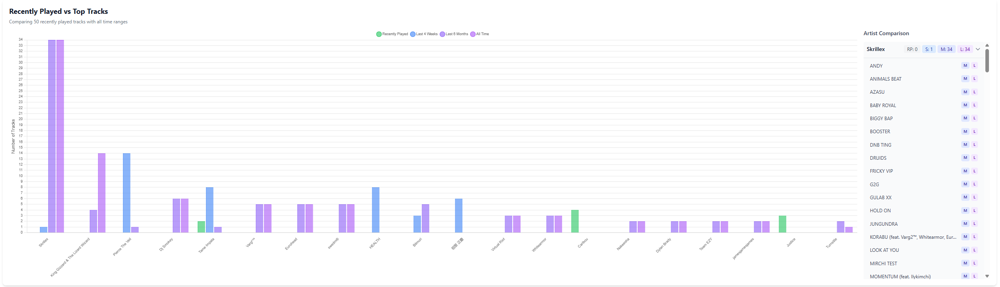
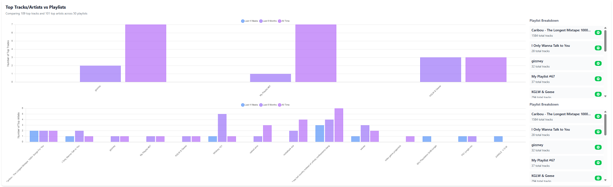

# SpotiMe 🎵

Visualize your Spotify listening statistics. Discover your top artists, tracks, and genre preferences with interactive charts and detailed analytics.

[https://spoti-me.vercel.app/](https://spoti-me.vercel.app/)

## 📖 Description

SpotiMe connects to your Spotify account to provide comprehensive insights into your music listening habits. The app displays your top artists and tracks across different time periods (last 4 weeks, last 6 months, and all time), along with interactive visualizations of your genre preferences and listening patterns.

## 🛠️ Tech Stack

- Vue 3
- TypeScript
- Vite
- Pinia
- Vue Router
- Tailwind CSS
- Chart.js / vue-chartjs
- Axios

## 🚀 Setup Instructions

### Prerequisites

- **Node.js** (v18 or higher recommended)
- **npm** or **yarn** package manager
- **Spotify Developer Account** - Required for API access
- **Backend API** - The app requires a backend server running on `http://127.0.0.1:4000` (or configure via environment variable)

### Installation Steps

1. **Clone the repository**
   ```bash
   git clone https://github.com/caleblmyers/SpotiMe.git
   cd spotime
   ```

2. **Install dependencies**
   ```bash
   npm install
   ```

3. **Configure environment variables** (optional)
   
   Create a `.env` file in the root directory:
   ```env
   VITE_API_BASE_URL=http://127.0.0.1:4000
   ```
   
   If not set, the app defaults to `http://127.0.0.1:4000`.

4. **Start the development server**
   ```bash
   npm run dev
   ```

### Backend Setup

This application requires a backend API server that handles Spotify OAuth authentication and API requests. The backend API is available in a separate repository:

**Backend Repository**: [SpotiMe-API](https://github.com/caleblmyers/SpotiMe-API)

For local development, clone and set up the backend API following the instructions in the [SpotiMe-API repository](https://github.com/caleblmyers/SpotiMe-API). Ensure your backend is:

- Running on `http://127.0.0.1:4000` (or update `VITE_API_BASE_URL`)
- Configured with Spotify OAuth credentials
- Exposing the following endpoints:
  - `/api/me` - Get user profile
  - `/api/top-artists` - Get top artists
  - `/api/top-tracks` - Get top tracks
  - `/api/genres` - Get available genres
  - `/api/recently-played` - Get recently played tracks
  - `/api/playlists` - Get user playlists
  - `/api/playlists/:id/tracks` - Get tracks from a playlist
  - `/api/playlists/search` - Search and analyze playlists
  - `/auth/login-spotify` - Initiate Spotify OAuth
  - `/auth/refresh` - Refresh access token
  - `/auth/callback` - Handle OAuth callback

### ⚠️ Spotify App Whitelisting

**Important**: Spotify development apps require email whitelisting for authentication.

#### For Live Application

If you're using the deployed version of this application, your Spotify account email must be whitelisted by the application administrator. If you try to authenticate and receive an error, you'll see a helpful error page explaining:

- Your account is not whitelisted
- How to request access
- Alternative: Running the app locally with your own Spotify app

#### For Local Development

To avoid whitelisting restrictions, you can run the application locally with your own Spotify Developer App:

1. **Create a Spotify App**:
   - Go to [Spotify Developer Dashboard](https://developer.spotify.com/dashboard)
   - Click "Create App"
   - Fill in app details and accept the terms
   - Note your `Client ID` and `Client Secret`

2. **Configure Your Backend**:
   - Update your backend to use your Spotify app credentials
   - Set the redirect URI to match your local development URL (e.g., `http://localhost:5173/auth/callback`)

3. **Update Environment Variables**:
   - Configure your backend with your Spotify app's Client ID and Client Secret
   - Ensure redirect URIs match in both your backend and Spotify app settings

This way, you can use the application without needing to be whitelisted, as you'll be using your own Spotify app credentials.

### First Run

1. Start the development server: `npm run dev`
2. Open your browser to `http://127.0.0.1:5173` (or the port shown in terminal)
3. Click "Connect with Spotify" to authenticate
4. After authentication, you'll be redirected to the dashboard
5. Explore your listening statistics!

## 📸 Gallery

### Main Views

#### Welcome Screen

*Initial welcome screen before authentication*

#### Dashboard

*Dashboard showing top tracks and artists with time range selector*

#### Graphs & Analytics

*Complete graphs page with all visualization charts*

### Interactive Charts

#### Genre Distribution

*Polar area chart showing genre distribution with expandable breakdown*

#### Artist Frequency

*Chart showing top artists by track count with expandable track lists*

#### Genre Evolution

*Radar chart comparing genre preferences across different time periods*

### Advanced Features

#### Recently Played Comparison

*Comparison of recently played tracks with top tracks across all time ranges*

#### Playlist Analytics

*Analysis showing top tracks and artists representation in user playlists*

## 📝 License

This project is licensed under the MIT License - see the [LICENSE](LICENSE) file for details.

## 🎵 Spotify API Attribution

This application uses the [Spotify Web API](https://developer.spotify.com/documentation/web-api) to access user data and listening statistics. 

**Spotify API Terms**: This application is not affiliated with, endorsed by, or sponsored by Spotify. Spotify and the Spotify logo are trademarks of Spotify AB. Use of the Spotify API is subject to the [Spotify Developer Terms of Service](https://developer.spotify.com/terms).

**Data Usage**: This application only accesses user data that you explicitly authorize through Spotify's OAuth flow. All data is processed locally in your browser and is not stored or transmitted to any third-party servers except Spotify's API.

## 📧 Contact

- **Email**: [cmyers5108@gmail.com](mailto:cmyers5108@gmail.com)
- **GitHub**: [@caleblmyers](https://github.com/caleblmyers)

---

Made with ❤️ using Vue 3 and TypeScript
